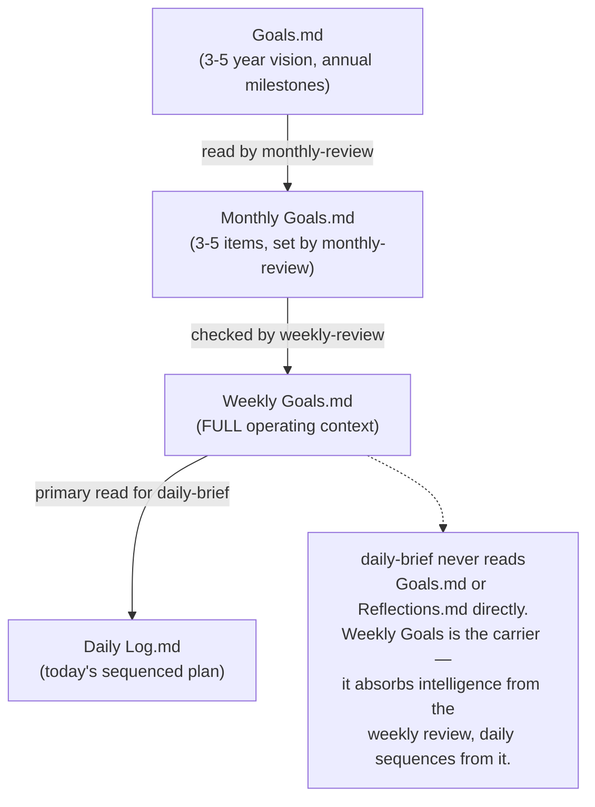

# Life Ops Plugin — Design Spec

**Purpose:** A packageable Cowork plugin that gives any user a daily/weekly/monthly rhythm for staying on top of their life and projects — without requiring a full project management tool.

**Core thesis:** The system works because it compounds. Daily habits build weekly clarity, weekly reviews build monthly perspective. The plugin provides the structure; the user provides the context. It gets richer over time.

---

## V1 Intently Scope

**Platform:** Intently mobile app (React Native + Supabase + Anthropic Managed Agents). State files live in Intently's per-user cloud store, not an Obsidian vault.

**Skills shipping in V1:** `daily-brief`, `daily-review`, `weekly-review`, `setup`, `update-tracker`.

**Skills deferred:** `daily-triage`, `monthly-review`, `project-continue`, `session-digest`, `vault-drift-check`, `notes-action-sync`. See `docs/backlog/deferred-features.md`.

**V1 cuts within shipped skills (made explicitly in SKILL.md):**
- `setup` Phase 1 (existing vault discovery) — V1 assumes new users; cut entirely
- `setup` Phase 4 (Health.md / wellness setup) — `health_file_enabled: false`
- `setup` Phase 5 (preferences conversation) — defaults used; only asks if user volunteers a preference
- `setup` Phase 6 file seeding — delegated to app platform (app provisions files on first run; skill does not create them)

**Monthly Goals.md is a separate file** — not embedded in `Ops Plan.md`. The spec has been updated to match this decision. All skill reads/writes use `Monthly Goals.md` directly.

---

## What Ships in the Plugin

### Skills (8)

| Skill | Trigger | Purpose |
|---|---|---|
| `setup` | Runs on install, re-runnable anytime | Onboarding conversation — discovers existing docs, seeds foundation, detects projects, sets preferences |
| `daily-triage` | Scheduled only — not user-invoked | Mechanical pre-briefing sort. Reads Inbox, routes items to the right trackers, checks Time-Sensitive deadlines, prunes completed items, flags stale ones. Runs before daily-brief so the briefing sees a clean state. |
| `daily-brief` | "morning brief", "what's today", "daily brief" | Morning orientation — collaborative day planning. Reads goals, ops plan, yesterday's log. Proposes a sequence, discusses with user, THEN writes the daily plan. |
| `update-tracker` | "update tracker", "log this", "I worked on X" | Universal project progress logger. Updates the right tracker + syncs the Command Center dashboard. |
| `daily-review` | "end of day", "daily review", "wrap up" | Evening wrap-up — captures what happened, trims yesterday to done-only, syncs project statuses, prompts for reflections |
| `weekly-review` | "weekly review", "plan next week" | Week assessment + next week planning. Reads reflections for patterns, scores the week, syncs all trackers, checks plan against monthly priorities, runs pre-mortems. |
| `monthly-review` | "monthly review", "big picture" | Strategic altitude check. Reads 4 weeks of reflections for patterns, 30-day calendar preview, goal-by-goal health check, project portfolio balance, pre-mortems, sets next month's priorities. |
| `project-continue` | "continue [project]", "where are we on [project]", "what's next on [project]" | Generic per-project orientation. Reads the named project's Tracker.md + Strategy.md, orients on current state, prompts strategy drift updates in-session. Works for any project detected during setup. |

### Supporting Infrastructure

These skills are dependencies of the user-facing skills, not user-invoked themselves. They ship alongside the core skills because the core skills won't work without them.

| Skill | Invoked By | Purpose |
|---|---|---|
| `session-digest` | `daily-brief`, `daily-review` | Sub-agent that produces a compact project-grouped digest of recent Claude work. Keeps parent skills' context lean by isolating transcript reading. |
| `vault-drift-check` | Scheduled task | Weekly maintenance scan for broken file references. Reports only, does not auto-fix. |

### Optional Add-On Skills (not installed by default)

These are skills the plugin can expose but doesn't install by default. They target specific user patterns — ship them as opt-in during setup or as a separate install.

| Skill | Audience | Purpose |
|---|---|---|
| `notes-action-sync` | Users who take manual prose session notes (coaching, therapy, recurring group meetings) in Obsidian | Scans files marked `meeting_series: true` for action items and directional guidance. Routes explicit tasks to trackers, directional/coaching guidance to a reflections doc. Marks processed sections with a breadcrumb. User-invoked, conversational — confirms before writing. Current status: exists in Muxin's vault; behavior in other vaults unverified. |

### Scheduled Tasks (6)

| Task | Default Schedule | Configurable |
|---|---|---|
| Daily triage | Daily, 6:30 AM (before morning brief) | Time |
| Morning brief | Daily, 7:00 AM | Time |
| Evening review | Daily, 5:00 PM | Time |
| Weekly review | Sunday, 9:00 AM | Day and time |
| Monthly review | 1st of month, 10:00 AM | Day and time |
| Vault drift check | Friday, 2:00 AM | Day and time |

### Config File

`life-ops-config.md` — stored in the user's notes folder root. Readable by all skills. Contains:

- Preferred schedule times
- Path to notes folder (set during setup)
- Reflection file name (user-chosen; default: Journal)
- List of detected projects (with paths to their tracker + strategy docs)
- Health/wellness file path (if user has one)
- Connected integrations (calendar, email)
- Any customizations to skill behavior

---

## Workflow Diagram

End-to-end flow across install → daily loop → weekly compounding → monthly strategic check. The cascade is what makes the system work: each layer only reads the one directly above it, so no single skill is trying to carry the whole vault in its context.

```mermaid
flowchart TD
    Install["`**Install**
    setup skill runs
    • Scan folder, detect structure
    • Seed Ops Plan, Goals, Weekly Goals
    • Classify projects → Tracker + Strategy
    • Write life-ops-config.md`"]

    Install --> DailyLoop

    subgraph DailyLoop["Daily Loop"]
        direction TB
        Triage["`**daily-triage** (6:30am, scheduled only)
        reads: Inbox, Time-Sensitive list
        → routes inbox items to trackers
        → flags upcoming deadlines
        → prunes done, flags stale
        → writes: Ops Plan, trackers, Daily Log flags`"]

        Brief["`**daily-brief** (7am)
        reads: Weekly Goals, Ops Plan,
        yesterday's log, Health, calendar, email
        → proposes sequence
        → CONVERSATION → confirms
        → writes today's plan to Daily Log`"]

        UpdateTracker["`**update-tracker** (any time)
        'I just worked on X'
        → updates tracker
        → syncs Ops Plan dashboard`"]

        ProjectContinue["`**project-continue** (any time)
        'continue [project]'
        → reads Tracker.md + Strategy.md
        → orients + prompts strategy drift`"]

        Review["`**daily-review** (5pm)
        reads: today's log, project trackers
        → captures done → trims yesterday
        → syncs Ops Plan
        → prompts reflection → appends Journal`"]

        Triage --> Brief --> UpdateTracker --> Review
        Brief -.-> ProjectContinue
        ProjectContinue -.-> UpdateTracker
    end

    DailyLoop -->|compounds 7 days| Weekly

    Weekly["`**weekly-review** (Sun 9am)
    reads: 7 daily logs, current Weekly Goals,
    ALL trackers, ALL strategies, Ops Plan,
    Monthly Goals, week's reflections, Goals, config
    → patterns from reflections → score week
    → archive past week → FULL tracker sync
    → check vs Monthly Goals → pre-mortems
    → WRITES new Weekly Goals (full op context)`"]

    Weekly -->|compounds 4 weeks| Monthly

    Monthly["`**monthly-review** (1st, 10am)
    reads: 4 weekly reviews, Goals, all strategies,
    all trackers, Ops Plan, Monthly Goals,
    4 weeks reflections, Master Backlog, 30-day calendar
    → reflection patterns → goal health check
    → portfolio balance → pre-mortems
    → UPDATES Goals, Monthly Goals, Ops Plan,
    all trackers`"]

    Drift["`**vault-drift-check** (Fri 2am)
    Background: reports broken refs`"]

    Monthly -.->|feeds next month| DailyLoop
    Drift -.-> DailyLoop
```



**The Goal Cascade** — this is the data spine that keeps the system coherent:



---

## File Architecture

The plugin uses a **single-file-per-type** approach, not individual dated files. This keeps navigation simple and the vault lean.

```
[User's Notes Folder]/
├── life-ops-config.md              ← Plugin config (skills read this)
├── 📥 Inbox.md                     ← Catch-all for stray notes from any AI session or quick capture.
│                                      Should be empty most of the time — daily-triage drains it
│                                      every morning. Users told during setup: "If you want any AI
│                                      to remind you of something, tell it to add to Inbox.md."
├── Ops Plan.md                     ← Command Center dashboard
│                                      - Project Dashboard (status, next action, priority tier)
│                                      - Time-Sensitive items (checked daily by daily-triage)
├── Monthly Goals.md                ← Current month's priorities (3-5 items, set by monthly review,
│                                      checked by weekly review). Replaced each month.
├── Goals.md                        ← Life/long-term goals, 3-5 year vision, annual milestones
├── Weekly Goals.md                 ← SINGLE FILE. Full operating context for the current week.
│                                      Contains: last week's review (patterns, scores, financial
│                                      zone, monthly priority check), this week's outcome-directions,
│                                      pre-mortems, system notes. The daily briefing reads this
│                                      file every morning — everything it needs is here.
│                                      Replaced each week by the weekly review.
├── Daily Log.md                    ← SINGLE FILE. Current week only (Sun-Sat).
│                                      Newest day prepended to top.
│                                      Morning brief writes AM plan. Evening review writes PM wrap-up.
│                                      Past weeks archived by the weekly review.
├── [Journal].md                    ← Running log of personal reflections, insights, patterns.
│                                      Name is user-chosen during setup (default: Journal).
│                                      Newest entry at top. Tagged: #self #grow #ant
│                                      Read by weekly + monthly reviews for pattern detection.
│                                      Does NOT carry operational weight — the weekly review
│                                      extracts patterns into Weekly Goals.md. Journal stays
│                                      pure: raw, honest, personal.
├── Health.md                       ← (Optional) Health goals + quick reference for daily nudges
├── Master Backlog.md               ← Ideas, someday/maybe, projects not yet activated
├── Past/
│   └── [Year] Archive.md          ← Archived daily log weeks + completed items
└── Projects/
    └── [Project Name]/
        ├── Tracker.md              ← Status, next action, phase, log (newest first)
        └── Strategy.md             ← The why, current approach, key decisions, learnings, open questions
```

### File Conventions

- **Log entries:** Prepend newest first (most recent at top)
- **Daily Log:** Current week only. Past weeks archived by weekly review.
- **Yesterday trimming:** Evening review strips yesterday's entry to Done-only (removes plan, calendar, admin flags)
- **Status indicators:** 🔴 Blocked, 🟡 In Progress, 🟢 Healthy, ⚪ Not Started
- **Priority tiers:** P1 = highest priority (morning focus blocks), P2 = secondary (afternoon), P3 = maintenance (only if time-sensitive)

---

## The Goal Cascade

This is the mechanism that connects long-term vision to today's to-do list. Each layer checks the one above it.

```
Goals.md (3-5 year vision, annual milestones)
    ↓ read by monthly review
Monthly Goals.md (3-5 items, set by monthly review — its own file, not in Ops Plan)
    ↓ checked by weekly review
Weekly Goals.md (FULL operating context for the week)
    Contains: last week's review (patterns, scores, financial zone,
    monthly priority status), this week's outcome-directions,
    pre-mortems, system notes
    ↓ read by daily brief (primary file)
Daily Log.md (today's plan, sequenced from weekly goals + project state)
```

The daily brief doesn't read Goals.md or Reflections.md directly — that alignment is handled by the monthly and weekly reviews. Weekly Goals.md is the single file that carries all the intelligence the daily needs. The daily just sequences today's work from the weekly context and current project state.

The weekly review explicitly checks: "Does the proposed week serve at least one of the monthly priorities? If not, name the gap." This is the cascade enforcement — lightweight, not heavy-handed. A quick sentence is enough.

If Monthly Goals.md is missing or stale (more than 5 weeks old), the weekly review flags it.

---

## The Reflections System

Reflections are a first-class feature, not an afterthought. Every review level (daily, weekly, monthly) both writes to and reads from the journal file. The journal is also the home for **Good Time Journal (GTJ) entries** — structured energy tracking data that coexists with freeform reflections. See "The Shared Journal Contract" below.

**Writing reflections:** Always prompted at the end of each review. Never forced — "skip" is always fine. When captured, use the user's own words with only the lightest edits (spelling, grammar). Do not paraphrase, summarize, or reframe.

**Reading reflections:**
- **Weekly review** reads the past week's entries before starting. Surfaces emotional threads and patterns that the task-focused Daily Log doesn't capture. When `#gtj` entries are present, the review also extracts engagement/energy patterns from their structured fields. The extracted patterns get written into the "Review of Last Week" section of Weekly Goals.md — the operational intelligence lives there, not in the journal. The journal stays pure.
- **Monthly review** reads the past 4 weeks. Looks for: recurring frustrations, self-insights (#self, #grow), automatic negative thoughts (#ant), energy patterns (what gave energy vs. what drained it). When `#gtj` entries are present, the monthly review has structured data to work with — it can identify specific activities that consistently energize or drain, not just infer from prose.
- **Daily briefing does NOT read the journal.** It gets everything it needs from Weekly Goals.md, which already contains the weekly review's extracted patterns.

**Tags (user-driven):**
Users define their own tag vocabulary during setup. Starter suggestions include `#self`, `#grow`, `#ant`, `#brags`, `#insight`, `#pattern`, `#stuck`. The plugin never hardcodes specific tag names — it reads the user's `suggested_tags` and `review_priority_tags` from config.

**Reserved tag: `#gtj`** — Used by the Good Time Journal skill to mark structured energy tracking entries. Reviews recognize this tag and parse the structured `Engagement:` / `Energy:` / `Context:` fields for richer pattern detection. Users do not need to type this tag manually — the GTJ skill adds it automatically.

**Format in journal file — freeform reflections:**
```markdown
### [Date]
[Their reflection text, in their own words]
Tags: [applicable tags]
---
```

**Format in journal file — GTJ entries (written by the GTJ skill):**
```markdown
### [Date]

**[Activity — one line] — [duration]** #gtj
Engagement: [Low | Medium | High | Flow] · Energy: [Draining | Neutral | Energizing]
Context: [1-line AEIOU insight — environment, interaction style, trigger, tools]
> [User's own words — follow-up response, unedited]
```

Both formats coexist under the same date headings. Multiple GTJ entries and freeform reflections can appear on the same day.

### The Shared Journal Contract

The journal file is the shared contract between the Life Ops plugin, the Good Time Journal skill, and the Job Search Agent. No plugin owns it exclusively.

**Discovery rules:**
- If Life Ops setup runs first, it creates the journal file and stores the filename in `life-ops-config.md` → `reflection_filename`. GTJ (if used later) discovers it via config.
- If GTJ runs first (e.g., via the Job Search Agent before Life Ops is installed), it creates a journal file following the same schema. When Life Ops is later installed, setup discovers the existing file and adopts it — no migration, no duplication.
- The journal file name is always user-chosen (default: `Journal`). Both plugins respect whatever name the user picked.

**Why this matters:** Everyone lives one life. Energy tracking, personal reflections, automatic negative thoughts, brags — these are all facets of the same self-knowledge. Splitting them across files creates islands of insight that never connect. The shared journal ensures that a weekly review can see both "I was in flow for 3 hours on positioning copy" (#gtj) and "I realized I keep circling the same fear about timeline pressure" (#ant) in the same read pass — and connect them.

---

## Setup Skill — Onboarding Conversation Flow

### Phase 1: Discover What Exists

The user selects a folder. The skill scans it and classifies what it finds:

- **Existing notes structure?** Look for folders like Daily/, Weekly/, Journal/, Goals/, Projects/ — or an .obsidian/ folder indicating an Obsidian vault
- **Existing goal documents?** Scan for files with "goal" "plan" "objective" "resolution" in the name or content
- **Existing project tracking?** Look for files with "tracker" "status" "kanban" "board" "sprint" in the name
- **Existing journal/daily notes?** Look for date-named files or a folder of chronological entries
- **Existing health/wellness docs?** Look for health, fitness, nutrition, wellness files

**Conversation branch:**

If **nothing found**: "Looks like a fresh start — we'll build your system from scratch. Let me ask you a few questions to get started."

If **structure found**: "I can see you already have [describe what was found]. I'll work with your existing structure instead of creating a new one." → The skill adapts paths in the config rather than duplicating.

### Phase 2: Seed the Foundation Docs

Three mandatory documents, each populated through conversation:

**Ops Plan (Command Center)**

Conversation: "What are you actively working on right now? Not aspirations — things you've actually touched in the last two weeks."

For each item:
- "How would you describe the status — healthy, stuck, or not really started yet?"
- "What's the very next thing you'd do on this if you had an hour?"
- "How important is this relative to the other things? Would you call it your top priority, secondary, or more of a maintenance thing?"

Outputs a dashboard with priority tiers:

```markdown
# Ops Plan

## Project Dashboard — Priority 1 (Primary Focus)
| Project | Status | Next Action | Last Updated |
|---|---|---|---|
| [name] | 🟡 | [action] | [date] |

## Project Dashboard — Priority 2 (Secondary)
...

## Project Dashboard — Priority 3 (Maintenance / As-Needed)
...
```

Monthly priorities are seeded into `Monthly Goals.md` (not Ops Plan):

```markdown
# Monthly Goals — [Month Year]
*Set by [date] setup. The weekly review reads this file before planning each week.*

1. [Priority from the goals conversation]
2. ...
3. ...
```

**Goals**

Conversation: "What matters to you right now — not just tasks, but outcomes? If three months from now things have gone well, what's different?"

The skill organizes responses into goal areas. Doesn't need to be exhaustive — 2-5 meaningful goals is enough. These can be professional, personal, health, financial, creative — whatever the user cares about.

**Weekly Goals**

Conversation: "Looking at this week specifically — if the week goes well, what would you have moved forward? Try to keep it to 3-5 things."

The skill connects each weekly goal to a project or life goal where possible, but doesn't force it.

### Phase 3: Detect Projects

For each item from Phase 2, the skill classifies it.

**Project signals (needs a tracker + strategy doc):**
- Multi-week timeline — won't be done this week
- Multiple steps or phases — not a single action
- Requires tracking decisions, status, or history
- Has dependencies (on other people, events, outputs)
- Needs collaborative goal-finding — the "what to do next" isn't always obvious
- Benefits from a "why" document — the logic behind the project evolves with new learnings

**Task signals (just goes into weekly goals):**
- Completable in one session
- Clear and obvious next step
- No history or decisions to track

**Goal signals (goes into Goals.md):**
- Outcome-oriented — "be healthier" not "go to gym"
- Not directly actionable without being broken into projects/tasks
- Longer time horizon than a week

**For each detected project, the skill creates two documents:**

**Tracker.md** — the operational state

```markdown
# [Project Name] Tracker

## Status
Phase: [phase] · Status: 🟡 · Last: [what happened] · Next: [next action]

## Log
### [Date]
- Initial setup via Life Ops onboarding
- [Any context the user shared about current state]
```

**Strategy.md** — the why and the logic

```markdown
# [Project Name] Strategy

## Why This Project Exists
[Captured from the onboarding conversation]

## Current Approach
[How they're going about it — methods, tools, principles]

## Key Decisions
[Empty — will accumulate as the project evolves]

## Learnings
[Empty — will accumulate as the project evolves]

## Open Questions
[Anything the user mentioned being unsure about]
```

The strategy doc is meant to evolve. It's not a plan that gets written once — it's a living document where the user captures why they're doing what they're doing, and updates it as they learn. Weekly reviews lightly prompt strategy checks; monthly reviews explicitly audit them.

### Phase 4: Optional — Health/Wellness Setup

"Do you have any health or wellness goals you'd like a gentle daily nudge about? Things like exercise, sleep, nutrition, hydration — anything you want to stay aware of without it feeling like a chore."

If yes: create Health.md with the user's goals and a quick-reference section the morning brief can rotate through. The nudge is conversational, 1-2 sentences woven into the briefing — not a checklist.

If no: skip. The morning brief won't include health nudges.

### Phase 5: Preferences

- **Reflection file name?** "The daily and weekly reviews will prompt you to capture reflections — thoughts, feelings, things you noticed. What do you want to call that space?" Default: Journal. Examples: Reflections, Notes to Self, Inner Log, Brain Dump — or anything that feels right. Whatever they choose, that's the filename (`[Name].md`) and how the skill refers to it throughout.
  **Journal discovery:** Before asking, check if a journal file already exists — it may have been created by the Good Time Journal skill (via the Job Search Agent) before Life Ops was installed. Look for files with dated reflection entries or `#gtj` tags. If found, confirm with the user: "I found [filename] — it looks like you've been using this for reflections. Want to keep using it?" If yes, adopt it and store the name in config. No duplication, no migration.
- **Morning brief time?** Default: 7:00 AM
- **Evening review time?** Default: 5:00 PM
- **Weekly review day/time?** Default: Sunday 9:00 AM
- **Monthly review day/time?** Default: 1st of month, 10:00 AM
- **Connected integrations?** If Google Calendar MCP is available: "Want your morning brief to include today's calendar?" If Gmail: "Want it to flag important unread emails?"
- **Day structure preference?** "Do you prefer creative/strategic work in the morning and admin in the afternoon, or the other way around?" Default: creative mornings.

Preferences get written to `life-ops-config.md`.

### Phase 6: Seed Remaining Files

Create the remaining files with minimal content:
- Monthly Goals.md — seeded with priorities from the Phase 2 goals conversation (see template above)
- Daily Log.md — empty, ready for first morning brief
- [User's chosen name].md — empty, with year heading (this is the reflection file — Journal by default)
- Master Backlog.md — empty, with brief explanation of purpose
- Past/ folder — empty

---

## Skill Behaviors

### Daily Triage (Pre-Briefing)

**Reads:** Inbox.md, Ops Plan (Time-Sensitive section), Daily Log (today's entry if it exists)

**Writes:** Ops Plan (Time-Sensitive table — add routed items, prune done), relevant project trackers (route items), Weekly Goals (this-week tasks from inbox), Daily Log (time-sensitive flags for today), Inbox.md (clears routed items)

**Mode:** Mechanical and autonomous. No conversation. Runs on a scheduled task before the morning brief. Designed so the briefing sees a clean state and doesn't have to do sorting work.

**Flow:**

1. **Process the Inbox:** Read each item under `## Unprocessed`. Classify: has a deadline → Time-Sensitive; belongs to a known project → that tracker; this-week task → Weekly Goals; doesn't fit anywhere → leave in Inbox with a flag for the user.

2. **Check Time-Sensitive deadlines:** Read the Time-Sensitive table in Ops Plan. Flag anything due within 3 days (or overdue) by adding it to today's Daily Log under a ⚠️ Time-Sensitive Flags heading. Remove completed items. Flag stale items (no date, or unchanged for 2+ weeks).

3. **Sanity check:** If the Time-Sensitive list has more than 10 items, note it in the run summary — pressure to move things to project trackers or drop them.

4. **Report:** Brief summary of what was routed, flagged, pruned. Session-log only — does not write a report file.

**Important:** Triage never does planning work. It only sorts, routes, flags, and prunes. The daily-brief remains responsible for the conversation about what to actually do today.

---

### Daily Brief (Morning)

**Reads:** Weekly Goals (this is the primary file — contains last week's review with patterns/scores/financial zone, this week's outcome-directions, pre-mortems, and system notes), Ops Plan (dashboard + next actions), Daily Log (yesterday's entry), Health.md (if exists), config

**Writes:** Today's entry in Daily Log (ONLY after user confirms the plan)

**Flow:**

1. **Orient:** Read Ops Plan, Weekly Goals, and yesterday's daily log entry. Understand current project state, what carries forward, what's planned for the week.

2. **Check calendar and email** (if connected): Today's schedule, anything urgent or time-sensitive.

3. **Health nudge** (if Health.md exists): Read the quick reference section. Include a brief, warm nudge — 1-2 sentences, woven into the briefing. Rotate focus areas so it doesn't repeat the same thing daily. Conversational and kind, not a guilt trip.

4. **Propose the day — collaboratively:** Present a conversational briefing that includes:
   - What's on the calendar
   - Any email flags
   - The 1-2 most important things for today (from the Command Center's blockers and next actions)
   - Any deadlines creeping up this week
   - If a project status looks stale or a blocker has been sitting too long, flag it gently
   - A PROPOSED day sequence (morning block, afternoon block) — framed as a suggestion, not a decision

   Then ASK the user: What do they want to focus on? What's their energy like? Any overrides or updates? **Wait for response. Discuss. Confirm together.**

   This step is the core of why the morning brief works. It forces engagement with the plan instead of passively reading one. The sequence should honor single-focus blocks — one project at a time, not interleaving.

5. **Write today's plan:** ONLY after the sequence is confirmed, prepend today's entry to the Daily Log. Structure:
   - Health/urgent flags at top (if any)
   - Morning block: primary focus work. Pull from P1 projects.
   - Afternoon block: secondary work, admin, errands. Pull from P2/P3 projects.
   - Admin flags: anything from email or pending items

   The plan should reflect what was actually agreed on, not a generic template.

**Important notes:**
- The Daily Log only contains the current week (Sun-Sat). Don't read the archive.
- Keep the briefing warm but efficient — clarity, not a wall of text.
- If no meetings and no urgent emails, say so briefly and focus on the plan.
- Do NOT write to the Daily Log until the user has confirmed the sequence. The conversation comes first.

---

### Daily Review (Evening)

**Reads:** Today's Daily Log entry (AM section), all project trackers (status lines), prior 7–14 days of Daily Log entries (for pattern detection), tomorrow's calendar (if connected), Ops Plan Time-Sensitive section, config

**Writes:** Today's Daily Log entry (PM section), updates project trackers if progress reported, Reflections.md (if user shares one)

**Flow:**

1. **Wrap up today:** Read today's entry in the Daily Log. Review what was planned vs. what actually happened. Add or update the Done section based on what was accomplished.

2. **Trim yesterday:** Find yesterday's entry in the Daily Log. Strip everything EXCEPT the Done section. Remove plan, morning/afternoon blocks, calendar items, admin flags. Keep only:
   ```
   ### YYYY-MM-DD — Day
   **Done:**
   - [items]
   ```
   This keeps the Daily Log lean. Yesterday's plan is no longer useful — only what was accomplished matters.

3. **Sync Command Center:** Read the Ops Plan. Read each linked project tracker to check for status changes. Update the Project Dashboard:
   - Status indicators (🔴🟡🟢⚪) if a project's state changed
   - "Next Action" column to reflect current next step from each tracker
   - "Status" text if meaningful progress was made or a blocker cleared/appeared
   - "Last updated" date
   - Do NOT change priority tiers, time budgets, or project structure — only refresh status/next-action within the existing layout

4. **Surface recurring patterns:** Scan the prior 7–14 days of Daily Log entries (and the journal if available) for themes that appear across multiple days. Surface any pattern seen **two or more times** — name it concretely with a count. If no supportable pattern, do not invent one. Delivered as a brief observation inside the narrative, not a separate section.

5. **Shape tomorrow:** Include one grounded, factual next-day preview. Pull from tomorrow's calendar (if connected), the Ops Plan Time-Sensitive section, and today's pacing signal (intense day → suggest a lighter tomorrow). Anchor the suggestion in observed state, not generic advice. One or two sentences, no more. This is a preview, not a plan-ahead or commitment.

6. **Prompt for reflections (and optional GTJ capture):** "Anything land for you today? A thought, a feeling, something you noticed? Even one sentence is fine. Or skip — no pressure."

   If shared: append to the journal file at the top of the current year's section, using their own words.

   **GTJ nudge (optional, not forced):** If the user has been doing GTJ tracking (check for recent `#gtj` entries in the journal), add a light prompt: "Any activity today worth logging for energy?" If they describe one, capture it using the GTJ entry format (`#gtj` tag, Engagement/Energy/Context fields). This embeds energy tracking into the existing daily rhythm without requiring a separate GTJ session. If the user hasn't started GTJ or doesn't respond to the nudge, move on — never nag.

**Important notes:**
- If the user engages in conversation during the review (asks questions, vents about the day), be present for that. The review is a touchpoint, not just a file operation.
- Keep the wrap-up conversational and concise.

---

### Weekly Review

**Reads:** All daily log entries from the past week, Weekly Goals (current week), all project trackers (full docs), all project strategy docs, Ops Plan (dashboard), Monthly Goals.md, Reflections.md (past week), Goals.md, config

**Writes:** Next week's Weekly Goals (including: review of last week with patterns/scores/financial zone/monthly priority check, this week's outcome-directions, pre-mortems, system notes — the full operating context the daily briefing needs), updates Ops Plan dashboard (full sync), updates all project trackers, archives past week from Daily Log to Past/Archive, Reflections.md (if user shares a personal reflection — but operational review content goes into Weekly Goals, not Reflections)

**Flow:**

0. **Read this week's journal entries:** Before anything else, read all journal entries from the past week — both freeform reflections and `#gtj` entries. Surface emotional threads, patterns, or insights worth carrying into the review. For `#gtj` entries, parse the structured Engagement/Energy/Context fields to identify energy patterns alongside the emotional threads from prose reflections. Mention anything notable before moving into the goals section. This gives context that the task-focused Daily Log doesn't capture. These extracted patterns (including energy patterns from GTJ data) will be written into the "Review of Last Week → Reflection patterns" section of Weekly Goals.md — not left in the journal. The journal stays pure; Weekly Goals carries the operational intelligence.

1. **Surface incomplete goals — collaboratively:** Review what was planned for this week. Surface *what* didn't happen. Do NOT infer *why*. You may offer relevant observations from the week's data — journal entries, calendar density, notable patterns in the daily logs — as context the user can consider, but frame them as offerings, not conclusions. Ask the user to walk through the reasons together. The reasons are often more nuanced than what can be reconstructed from notes. This section is a conversation, not a report.

2. **Score the week:** Assign a 1-10 score on output quality, focus, energy, and progress toward big goals — record these in the "Review of Last Week" section of Weekly Goals.md so downstream agents (daily-brief, monthly-review) can use them as system signal. Present the week *qualitatively* to the user in conversation (e.g., "productive but scattered", "recovery mode", "steady"); do not lead with the number. Surface the numeric score only if the user explicitly asks. One sentence on what made the biggest difference (positive or negative).

3. **Archive and sync:** Trim yesterday's entries to Done-only. Archive the past week's Daily Log entries to Past/Archive. Update the Command Center dashboard to reflect current state across ALL projects. This is the full tracker sync — the equivalent of running update-tracker across everything. Check each project tracker against the Ops Plan dashboard and reconcile any drift.

4. **Check against Monthly Goals:** Read `Monthly Goals.md`. Before proposing next week's plan, check: does the proposed week serve at least one of the monthly priorities? If not, name the gap explicitly. A quick sentence is enough: "This week's plan serves priorities #1 and #2. Priority #3 hasn't had a dedicated nudge — worth adding something?" The point is awareness, not guilt.

   If `Monthly Goals.md` is missing or stale (more than 5 weeks old), flag it: "Monthly goals are stale — next monthly review should refresh them."

5. **Plan next week:** Based on the Command Center dashboard, monthly priorities, and what happened this week, propose a concrete focus for next week. What are the 1-2 things that matter most? Connect them to monthly priorities where possible. These become the outcome-directions in the new Weekly Goals.

6. **Pre-mortem next week's risks:** What's most likely to derail the plan? Name it specifically, with evidence, and suggest a mitigation. These go into the Pre-Mortems & Risk Flags section of Weekly Goals.

7. **Strategy check (light touch):** "Any of your project strategies feel off? Anything you've learned this week that changes how you're approaching something?" If yes, prompt to update the relevant Strategy.md.

8. **Write the full Weekly Goals file:** This is the critical output step. The weekly review assembles the complete Weekly Goals.md for next week:
   - **Review of Last Week:** Reflections patterns, outcome scores, financial zone, monthly priority status, biggest positive/negative. This is the intelligence layer the daily briefing needs.
   - **This Week's Outcome-Directions:** The agreed-upon focus areas with Why now / Known paths / Done when.
   - **Pre-Mortems & Risk Flags:** From step 6.
   - **Recurring commitments and "Not this week" boundaries.**
   - **System Notes:** Any operational flags for the daily briefing/review (tracker sync issues, format changes, queued fixes).
   - **Previous week's "Done" summary** (stays for one week, then archives).

   The previous week's full operating context gets replaced. Only the Done summary carries forward.

9. **Prompt for Reflections:** Ask if anything is worth capturing — a decision made, something learned, something to remember. This goes into the Reflections file (the journal), NOT into Weekly Goals. Weekly Goals is operational; Reflections is personal.

---

### Monthly Review

**Reads:** All weekly reviews from the past month, Goals.md, all project strategy docs, all project trackers, Ops Plan, Monthly Goals.md, Reflections.md (past 4 weeks), Master Backlog, calendar (next 30 days if connected), config

**Writes:** Updates Goals.md (if milestones shifted), updates Ops Plan (dashboard + time-sensitive section), updates Monthly Goals.md (replaces with next month's priorities), updates ALL project trackers that changed, Reflections.md (if user shares)

**Flow:**

1. **Read the North Star and Current State:** Read Goals.md (long-term vision, annual milestones), Ops Plan (project dashboard), Monthly Goals.md (current month's priorities), Past/Archive (what actually got done last 4 weeks), Master Backlog (anything to promote or drop), all project trackers.

2. **Scan journal for Patterns:** Read the past 4 weeks of the journal file. Look for:
   - Recurring frustrations or friction points — things that keep coming up
   - Self-insights tagged #self or #grow — real signal about what's working
   - Automatic negative thoughts tagged #ant — if the same one keeps appearing, name it
   - Energy patterns — what gave energy, what drained it? Mismatch between time spent and what actually energizes?
   - **GTJ data (if present):** When `#gtj` entries exist, parse the structured Engagement/Energy/Context fields for concrete evidence. Instead of inferring "she seems drained by meetings" from prose, you can cite "4 of 6 logged meetings scored Draining; the 2 that scored Energizing were both small-group problem-solving." This is the payoff of structured capture — specificity in pattern detection.

   Summarize in 3-5 bullets. These patterns inform the goal health check. If the user has an Energy Profile (`#gtj #energy-profile` entry), cross-reference current month's patterns against the profile to detect drift — are they spending time on things that consistently drain them?

3. **Calendar Preview — Next 30 Days** (if calendar connected): Key dates and deadlines, trips/travel (reshape what's realistic), appointments, conferences or networking events (opportunities). Frame as context for monthly priorities: "Given what's coming up, here's what's realistic and what's strategic this month."

4. **Goal-by-Goal Health Check:** For each goal area in Goals.md:
   - Current status (1-2 sentences from Ops Plan + trackers)
   - On track / drifting / blocked?
   - What's getting attention vs. what's being neglected?
   - Any Reflections patterns relevant to this goal?

   If a goal is drifting, name it directly. Don't soften it — but don't guilt-trip either. The goal is awareness.

5. **Project Dashboard:** For each active project:
   | Project | Status | Goal Served | Getting enough time? | Next Action |
   Check portfolio balance: Are P1 items actually getting the most time? Are P3 items quietly eating hours? Is anything parked that should activate, or active that should park? Has anything crept in that isn't in the Ops Plan? Are time-capped items staying within bounds?

6. **Pre-Mortems:** Run 2-3 specific pre-mortems grounded in what the data shows: "It's the end of next month and [specific thing] didn't happen. What went wrong?" Be specific — use evidence from trackers, archive, Reflections, calendar. Name the mechanism of failure.

7. **What Needs to Change:** Based on everything — goal health, project status, Reflections patterns, calendar context, pre-mortems — propose specific changes:
   - Should any weekly priority shift?
   - Should any project move between active/parked?
   - Should any goal get a tracker, a conversation, or a deadline it doesn't have?
   - Upcoming calendar events that create opportunities or constraints?
   - Reflections patterns that suggest a change in approach?

   Present findings, then shift to coaching mode: "What resonates? What feels off? What do you want to adjust?"

8. **Update ALL Files:** This is critical. The user starts their day from the trackers. If the monthly review surfaces new priorities but doesn't update the trackers, tomorrow's daily briefing plans from stale data.

   - **Goals.md** — update milestones if shifted, add/remove as agreed
   - **Ops Plan — Project Dashboard** — update status and next action for EVERY project that changed. The "Next Action" field is what the daily briefing reads — it must be current.
   - **Monthly Goals.md** — replace entirely with next month's priorities (3-5 items, specific enough to evaluate, balanced across goal areas, informed by calendar)
   - **All Project Trackers** — update any tracker whose status or next action shifted
   - **Master Backlog** — update promoted/dropped items

   **The test:** If the user opens any tracker tomorrow morning, does it reflect reality as of this conversation? If not, update it now.

9. **Close Out — Capture in Reflections:** "This was a bigger-picture check-in. Anything landing for you — about direction, pace, what matters? Even a sentence is fine."

**Important notes:**
- This review is a CONVERSATION, not a report. Present research, then listen. The user's judgment about their own life priorities is what matters — the system's job is to surface what the data shows and ask good questions.
- Be honest but compassionate. If something is drifting, name it clearly without guilt-tripping.
- If this is an automated run and the user isn't present: produce the full review as a report, do NOT update Goals.md (requires their agreement), DO update Monthly Goals.md based on best judgment, hold questions for them to respond to later.

---

### Update Tracker (Universal Logger)

**Reads:** Ops Plan (to find which projects exist and where their trackers are), relevant project tracker(s)

**Writes:** Project tracker(s), Ops Plan dashboard (syncs status/next action)

**Flow:**

1. **Read the Command Center:** The Ops Plan lists every active project, its status, next action, and which tracker file it points to.

2. **Figure out what was worked on:** Match what the user said to projects in the Command Center. If ambiguous, ask.

3. **Update the relevant tracker(s):**
   - Check off completed items
   - Update status text if a phase changed
   - Add completion dates
   - Note new blockers or cleared blockers
   - Do NOT reorganize the tracker — update within the existing layout

4. **Sync the Command Center:** Update the corresponding line in the Ops Plan dashboard:
   - Status indicator (🔴🟡🟢⚪) if the project's state changed
   - "Status" text
   - "Next Action"
   - "Last updated" date

5. **Confirm:** Brief, conversational confirmation of what was updated.

**Important:** This skill only updates trackers and the Command Center. It doesn't do project work or planning.

---

### Project Continue (Generic)

**Reads:** Named project's `Tracker.md` and `Strategy.md`, Ops Plan (to confirm the project is active and find the tracker path)

**Writes:** Nothing directly. May prompt strategy updates in-session, which the user confirms and the skill then writes to `Strategy.md`.

**Flow:**

1. **Identify the project:** Match the user's phrasing (`"continue job hunt"`, `"where are we on film"`) to a project in the Ops Plan dashboard. If ambiguous, ask.

2. **Load context:** Read the project's Tracker.md (current status, next action, log) and Strategy.md (why, current approach, key decisions, learnings, open questions).

3. **Orient:** Briefly summarize where things stand. Surface the next action and any open questions or stale decisions.

4. **Prompt strategy drift:** Ask a light-touch question: "Anything about how you're approaching this that's shifted recently? Any learning worth capturing?" If the user names a shift, update Strategy.md with their words — don't paraphrase.

5. **Hand off:** Ready to continue the work. Does not do the work itself — the user drives from here.

**Important:** This is the generic version. Users who want deeper domain prep on a specific project (e.g., autonomous job-board scanning for a job hunt) can write a specialized `[project]-continue` skill that extends this pattern. The generic covers the ~70% case — read tracker, orient, prompt drift.

---

### Vault Drift Check

**Reads:** All skill files, all tracker files, config

**Writes:** Nothing (report only)

A weekly maintenance scan. Checks all project skills and tracker files for file path references that no longer resolve to existing files. Reports broken references with suggestions for fixes. Does NOT auto-fix — just reports.

This catches situations where a file got moved, renamed, or deleted but the skills/trackers still reference the old path. Left unchecked, this causes skills to fail silently or plan from stale data.

---

## What Does NOT Ship

See `docs/backlog/deferred-features.md`.

---

## Design Principles

**Opinionated but not rigid.** The plugin creates structure because without it nothing works. But every preference is configurable, and the setup skill adapts to what exists rather than demanding a blank slate.

**Thin on Day 1, rich by Week 4.** A new user's first morning brief will be sparse. The plugin should say so: "Your briefs will get richer as you use the system. The first week is about building the habit." The weekly review is the engine that makes everything compound.

**The morning brief is a conversation, not a report.** It proposes, asks, listens, adjusts, and only then writes. This is the single most important design decision — it forces engagement instead of passive consumption.

**Strategy is separate from status.** Every project gets two docs: a tracker (what's happening) and a strategy (why it exists and how you're approaching it). The tracker changes daily. The strategy evolves with learnings. Keeping them separate prevents the "why" from getting buried under status updates.

**Reflections are the self-awareness layer.** Every review prompts for them. Weekly and monthly reviews read them for patterns. They're captured in the user's own words. This is what elevates the system from task management to something that actually helps you understand yourself.

**The cascade keeps everything connected.** Goals → Monthly Goals.md → Weekly Goals → Daily Plan. Each layer checks the one above it. The weekly review is the enforcement mechanism — it explicitly names gaps between the weekly plan and the current month's goals.

**Reviews prompt strategy evolution.** Weekly reviews lightly ask "does anything feel off?" Monthly reviews explicitly audit whether projects still serve their goals and whether strategies still make sense.

**Tracker sync is built into the rhythm.** The evening review syncs individual projects. The weekly review does a full sync across everything. This prevents drift without requiring a separate maintenance mindset.

**The system absorbs chaos.** Days get derailed. The evening review captures what actually happened (not what was planned), and the weekly review recalibrates without guilt. The system is forgiving by design.

**Projects are detected, not declared.** The setup skill listens to what the user describes and classifies based on complexity signals. This catches projects the user might not call "projects" but that clearly need tracking.

---

## Cross-Platform Strategy

The plugin is built for Cowork. It also works in Claude Code (degraded) and can be adapted to OpenClaw or other agent environments by users who want to set it up themselves.

**Architecture:** Modular skills with a shared reference doc. Each skill has its own SKILL.md with triggers and flow, but all skills read `references/life-ops-system.md` for shared conventions (file paths, status indicators, trimming rules, cascade logic, sync rules). This keeps individual skills lean and prevents convention drift.

```
life-ops/
├── PLUGIN.md                    ← Plugin manifest
├── references/
│   └── life-ops-system.md       ← Shared conventions all skills read
├── skills/
│   ├── setup/SKILL.md
│   ├── daily-triage/SKILL.md
│   ├── daily-brief/SKILL.md
│   ├── update-tracker/SKILL.md
│   ├── project-continue/SKILL.md
│   ├── daily-review/SKILL.md
│   ├── weekly-review/SKILL.md
│   ├── monthly-review/SKILL.md
│   ├── session-digest/SKILL.md  ← Sub-agent; invoked by daily-brief + daily-review
│   └── vault-drift-check/SKILL.md
└── config-template.md           ← Seeded during setup
```

**Configurable skills:** Users install the full plugin but can toggle user-facing skills on/off. The only hard dependency is that `setup` must run first (it creates the files everything else reads). Supporting infrastructure skills (`session-digest`, `vault-drift-check`) are not toggleable — they're invoked by other skills and the scheduler.

If a user turns off `weekly-review`, the daily rhythm still works — they lose the compounding layer and will eventually get a stale `Monthly Goals.md` flagged. If `monthly-review` is off, the weekly review's cascade check still runs but will note that `Monthly Goals.md` hasn't been refreshed. If `daily-triage` is off, the daily brief still runs but will see un-sorted Inbox items and unflagged deadlines — degraded but not broken. Graceful degradation, not breakage.

**Platform-specific behavior:**

| Capability | Cowork | Claude Code | Intently mobile |
|---|---|---|---|
| User-facing skills (8) | Full | Full | 5 of 8 (see V1 Intently Scope above) |
| Supporting infrastructure (session-digest, vault-drift-check) | Full | Full | Partial — session-digest deferred |
| Scheduled tasks | Yes (6 tasks) | No — manual invocation only | Yes (Managed Agents + pg_cron) |
| Calendar/email MCP | Yes if connected | No | Yes if connected |
| Conversational UX | Native | Works but terminal-based | Native mobile chat interface |
| Vault drift check | Standalone scheduled task | Folded into weekly review | Deferred |
| Daily triage | Scheduled pre-briefing | Runs as a user-invoked step at start of the morning | Deferred |

**MCP fallback rule:** Every skill that reads calendar or email must handle the case where those integrations aren't available. When absent: skip the step, note "no calendar connected" or "no email connected" in the output, and continue. Never error on missing integrations.

**Other agent environments (OpenClaw, etc.):** This plugin is built and tested for Cowork. If you want to run it in OpenClaw or another agent environment, you're welcome to — the skill architecture is portable. However, you are responsible for your own setup, security, and any platform-specific configuration. Muxin does not maintain or support OpenClaw-specific packaging, and any security or privacy characteristics of your chosen platform are outside the scope of this plugin.

---

## Distribution & Attribution

**Attribution:** "by Muxin Li" — baked into plugin metadata, skill descriptions, and a welcome message on first install. No product brand name yet; the author name is the brand for now. Include a link back to Muxin's site and an invitation to connect / give feedback. Every copy that travels carries the name with it — distribution becomes its own marketing.

**Primary audiences:**
- **Women in Product** (WIP AI Weekly / Hackathon community) → Cowork plugin. Less technical audience; Cowork's conversational UX and scheduled tasks are the natural fit.
- **ABC** (invite-only builder community) → Cowork plugin, with the understanding that builders in this group may adapt it to OpenClaw or other environments on their own. The plugin is portable; platform-specific setup is their responsibility.
- **Claude Code users** → Same skills work via manual invocation. No scheduled tasks or MCP integrations, but the core rhythm functions.

**Distribution model — freemium by depth:**
- **Public/open version:** Principles + a few core routines. Enough to be genuinely useful and demonstrate the thinking. This is the version that travels.
- **Full version:** Complete skill set, all scheduled tasks, the full review cascade. Available to people who engage directly — through feedback, conversation, or community participation.

**Format:** Installable .plugin file. Not a static doc or PDF — the plugin runs inside the user's environment, which keeps Muxin as the builder/maintainer at the center. A document travels without the author; a living tool traces back to its creator.

**Strategic intent:** The plugin is a portfolio piece and lead gen tool for Lost Woods. It demonstrates systems thinking, product design, and the kind of workflow architecture Muxin offers clients. People who use it and find it valuable are warm leads for consulting, hiring, or collaboration.

**Why not hoard it:** The principles and structure aren't the moat — the diagnostic ability to know when and how to adapt the system is. That's the consulting layer. Sharing the tool widely builds reputation; the expertise to customize it is what people pay for.

---

## Open Questions for Build Phase

1. ~~**Plugin name** — "Life Ops", "Daily Ops", "Rhythm", something else?~~ **Decided:** No product name yet. Ship as "by Muxin Li" for now. The name can come later once the thing has been used and a name earns itself.
2. ~~**Sharing format** — installable .plugin file alongside the post, or describe the system and let people request it?~~ **Decided:** Installable .plugin file. Freemium model — lighter public version, full version for engaged users. See Distribution & Attribution section above.
3. **Integration depth** — should setup actively probe for Google Calendar / Gmail MCPs, or just note them in config as optional?
4. **Project templates** — one universal tracker/strategy template, or different templates based on project type (creative, career, learning, health)?
5. **Monthly review output location** — separate Monthly/ folder, appended to Goals.md, or its own Reviews file?
